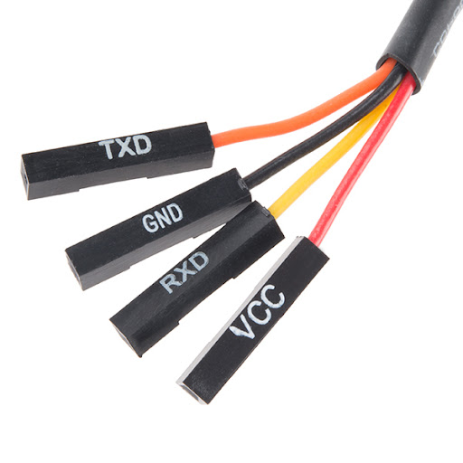
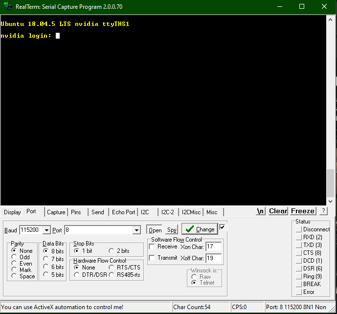

# HF5R0x-Firmware

Hexabitz Nvidia Jetson nano Interface Mudule Firmware

---

## Table of content

- [HF5R0x-Firmware](#hf5r0x-firmware)
  - [Table of content](#table-of-content)
  - [How to Compile using autotools](#how-to-compile-using-autotools)
  - [How to compile executable and link with shared library?](#how-to-compile-executable-and-link-with-shared-library)
  - [UART Connection](#uart-connection)
  - [What files should i be expecting to see](#what-files-should-i-be-expecting-to-see)
  - [| BOS_Porting.cpp | You can build here your functions that will handle the communication and decoding of the frames.                                                                                     |](#-bos_portingcpp--you-can-build-here-your-functions-that-will-handle-the-communication-and-decoding-of-the-frames-------------------------------------------------------------------------------------)
  - [Baud rate](#baud-rate)
  - [Functions that will help you to establish the connection](#functions-that-will-help-you-to-establish-the-connection)

## How to Compile using autotools

Install package

```bash
autoreconf --install
```

Create a new Directory and run the configuration

```bash
mkdir build
cd build
../configure
```

Run 'make' command,

```bash
make
make install
```

> See this [link](https://blog.usejournal.com/creating-debian-packages-cmake-e519a0186e87) to setup CMake for deb package creation

---

## How to compile executables and link with shared library?

Compile and Link lhexabitz library

```bash
g++ dem o.cpp -lhexabitz -I/user/include/hexabitz
```

---

## UART Connection

There is only one serial channel in the Jetson nano see the [link](https://www.jetsonhacks.com/nvidia-jetson-nano-j41-header-pinout/)

UART1 (3.3v, 115200BR 8N1)
    - J41 Pin 8  (TXD).
    - J41 Pin 10 (RXD).

Both with any given Ground Pin can establish a serial connection on the Jetson nano

First use an FTDI cable to connect to the Jetson nano:

| Cable              | Jetson Nano                          |
| :----------------- | :----------------------------------- |
| RED cable    (VCC) | You do not need this.                |
| Black cable  (GND) | with any given GND Pin on the board. |
| Yellow cable (RXD) | J41 Pin 8  (TXD).                    |
| Orange cable (TXD) | J41 Pin 10 (RXD).                    |



Then use [Putty](https://www.putty.org/), [Realterm](https://sourceforge.net/projects/realterm/) or any other software that can connect on the serial Port.

You will be promoted with a login prompt, type your User and Passward to open this channel and now you can connect to Hexabitz Modules!!



**Note:**

> Did you know that TX/RX channel can switch places in Hexabitz Modules.. But unless you've changed it manualy, RX are always on the Front face (Functionality side) and TX are always on the Back face (ARM Micro Processor side).

---

## What files should i be expecting to see

| File name       | Description                                                                                                                                                                          |
| :-------------- | :----------------------------------------------------------------------------------------------------------------------------------------------------------------------------------- |
| demo.cpp        | main program                |
| BOS.cpp         | This is a tiny version of The Bitz Operating System. [BOS](https://hexabitz.com/docs/code-overview/bos-module-parameters/)                                                           |
| serial.c        | The serial configuration and functions to control the peripheral.                                                                                                                    |
| MessageCode.h   | Contains a sample of Module's Message Codes that will be decoded by the BOS_Message.cpp file. [MessageCodes](https://hexabitz.com/docs/code-overview/array-messaging/message-codes/) |
| BOS_Message.cpp | Message Parssing and Decoding (Where all the magic happens).             [BOS Messages](https://hexabitz.com/docs/code-overview/array-messaging/)                                    |
| BOS_Porting.cpp | You can build here your functions that will handle the communication and decoding of the frames.                                                                                     |
---

## Baud rate

- The default BR for the Serial Peripheral is (115200). So you need to use this one when you are trying to open the channel (Logging in).
- On the other hand all Hexabitz Modules uses (921600) as a default value - Unless you've changed it manualy - which is why we've used (921600) in the Openserial function in the BOS_Message.cpp.

> If you have changed the Baud rate on the module's Port please change this value as well.

## Functions that will help you to establish the connection

These functions are found in serial.c

| Function        | Description                                                                                                                          |
| :-------------- | :----------------------------------------------------------------------------------------------------------------------------------- |
| serialFlush     | Flush the serial buffers (both tx & rx).                                                                                             |
| serialClose     | Release the serial port.                                                                                                             |
| serialPutchar   | Send a single character to the serial port.                                                                                          |
| serialPuts      | Send a string to the serial port.                                                                                                    |
| serialPrintf    | Printf over Serial.                                                                                                                  |
| serialDataAvail | Return the number of bytes of data avalable to be read in the serial port.                                                           |
| serialGetchar   | Get a single character from the serial device. ( Note: Zero is a valid character and this function will time-out after 10 seconds ). |

---

Wait for Projects on : [Hackster.io](https://www.hackster.io/hexabitz)

Learn more about us : [Hexabitz.Inc](https://hexabitz.com/)

---
